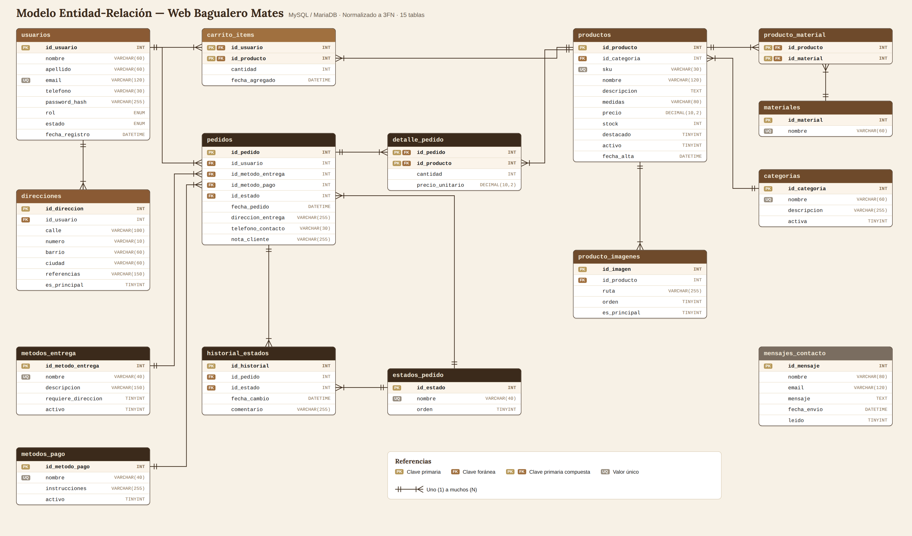

# Modelo Entidad-Relación (DER)

**Proyecto:** Web Bagualero Mates · **Motor:** MySQL / MariaDB (XAMPP) · **Normalización:** Tercera Forma Normal (3FN)

El script para crear la base de datos es [`server/database/bagualero_mates.sql`](../server/database/bagualero_mates.sql). Crea las 15 tablas, sus claves y restricciones, y carga datos iniciales: categorías, materiales, métodos de entrega y de pago, estados de pedido, un usuario administrador y productos de ejemplo.

**Notación:** pata de gallo. `||` = uno · `>|` = muchos. **PK** = clave primaria · **FK** = clave foránea · **UQ** = valor único.

---

## 1. Tablas

| # | Tabla | Qué guarda | PK |
|---|---|---|---|
| 1 | `usuarios` | Clientes y administradores, con su rol y su estado (activo o suspendido) | `id_usuario` |
| 2 | `direcciones` | Direcciones de entrega de cada usuario | `id_direccion` |
| 3 | `categorias` | Categorías del catálogo (Mates, Bombillas, Termos…) | `id_categoria` |
| 4 | `materiales` | Materiales posibles (Calabaza, Alpaca, Cuero…) | `id_material` |
| 5 | `productos` | Productos, con precio, stock y baja lógica (`activo`) | `id_producto` |
| 6 | `producto_material` | Relación N:M entre productos y materiales | `id_producto` + `id_material` |
| 7 | `producto_imagenes` | Fotos de cada producto | `id_imagen` |
| 8 | `carrito_items` | Productos en el carrito de cada usuario | `id_usuario` + `id_producto` |
| 9 | `metodos_entrega` | Envío a domicilio, retiro o punto de encuentro | `id_metodo_entrega` |
| 10 | `metodos_pago` | Transferencia, efectivo o tarjeta | `id_metodo_pago` |
| 11 | `estados_pedido` | Pendiente, Confirmado, Enviado, Entregado, Cancelado | `id_estado` |
| 12 | `pedidos` | Cabecera de cada pedido | `id_pedido` |
| 13 | `detalle_pedido` | Productos de cada pedido, con el precio al momento de la compra | `id_pedido` + `id_producto` |
| 14 | `historial_estados` | Registro de cada cambio de estado de un pedido, con fecha | `id_historial` |
| 15 | `mensajes_contacto` | Mensajes enviados desde el formulario de contacto | `id_mensaje` |

## 2. Relaciones y cardinalidad

| Relación | Cardinalidad | Clave foránea | Significado |
|---|---|---|---|
| usuarios — direcciones | 1 : N | `direcciones.id_usuario` | Un usuario puede tener varias direcciones |
| usuarios — carrito_items | 1 : N | `carrito_items.id_usuario` | Un usuario tiene varios productos en su carrito |
| productos — carrito_items | 1 : N | `carrito_items.id_producto` | Un producto puede estar en muchos carritos |
| usuarios — pedidos | 1 : N | `pedidos.id_usuario` | Un cliente puede hacer muchos pedidos |
| metodos_entrega — pedidos | 1 : N | `pedidos.id_metodo_entrega` | Cada pedido tiene un método de entrega |
| metodos_pago — pedidos | 1 : N | `pedidos.id_metodo_pago` | Cada pedido tiene un método de pago |
| estados_pedido — pedidos | 1 : N | `pedidos.id_estado` | Cada pedido tiene un estado actual |
| pedidos — detalle_pedido | 1 : N | `detalle_pedido.id_pedido` | Un pedido tiene uno o más productos |
| productos — detalle_pedido | 1 : N | `detalle_pedido.id_producto` | Un producto puede aparecer en muchos pedidos |
| pedidos — historial_estados | 1 : N | `historial_estados.id_pedido` | Un pedido pasa por varios estados |
| estados_pedido — historial_estados | 1 : N | `historial_estados.id_estado` | Cada registro del historial indica un estado |
| categorias — productos | 1 : N | `productos.id_categoria` | Una categoría agrupa muchos productos |
| productos — producto_imagenes | 1 : N | `producto_imagenes.id_producto` | Un producto tiene varias fotos |
| productos — materiales | **N : M** | tabla intermedia `producto_material` | Un producto combina varios materiales y un material está en muchos productos |

`pedidos` y `productos` también tienen una relación **N : M**, que se resuelve con la tabla intermedia `detalle_pedido`. Lo mismo pasa entre `usuarios` y `productos` a través de `carrito_items`.

## 3. Justificación de la normalización

**Primera Forma Normal (1FN):** todos los campos guardan valores atómicos y no hay grupos repetidos.
- Las imágenes de un producto no se guardan como una lista dentro de `productos`: van en `producto_imagenes`, una fila por foto.
- Los materiales de un producto tampoco se guardan como texto separado por comas: se relacionan con `producto_material`.

**Segunda Forma Normal (2FN):** en las tablas con clave compuesta, cada campo depende de la clave completa y no de solo una parte.
- En `detalle_pedido` (`id_pedido` + `id_producto`), la `cantidad` y el `precio_unitario` dependen del par completo: cuántas unidades de ese producto hay en ese pedido y a qué precio se vendió.
- El nombre del producto no se repite en el detalle: se obtiene a través de `id_producto`.

**Tercera Forma Normal (3FN):** no hay dependencias transitivas; ningún campo depende de otro campo que no sea clave.
- Los métodos de entrega, los métodos de pago y los estados son tablas propias. En `pedidos` solo están sus claves foráneas, no sus nombres ni sus descripciones.
- La categoría de un producto se guarda como `id_categoria`, no como texto.
- **El total del pedido no se guarda:** se calcula a partir de `detalle_pedido` (cantidad × precio unitario) con la vista `v_pedidos_totales`. Así se evita tener un dato redundante que pueda quedar desactualizado.

**Decisiones de diseño**

- **`detalle_pedido.precio_unitario`:** guarda el precio al momento de la compra. No es una redundancia, porque es un dato histórico propio de la venta: si el administrador cambia el precio del producto, los pedidos anteriores no cambian.
- **`pedidos.direccion_entrega`:** es una copia de la dirección al momento de la compra, por el mismo motivo. Si el cliente cambia su dirección después, el pedido conserva la dirección a la que se envió.
- **Baja lógica de productos (`activo`):** los productos no se borran físicamente, para no perder la integridad de los pedidos que los incluyen (HU-18).
- **`usuarios.estado`:** permite suspender cuentas y rechazar el login con un mensaje descriptivo (HU-21).

## 4. Restricciones de integridad

- **Claves foráneas con `ON DELETE CASCADE`** donde el dato hijo no tiene sentido sin el padre: direcciones, carrito, imágenes, detalle del pedido e historial.
- **Claves foráneas sin `CASCADE`** donde hay que proteger el historial: no se puede borrar una categoría, un método de pago o un estado que ya esté en uso.
- **`UNIQUE`** en `usuarios.email`, `productos.sku` y en los nombres de categorías, materiales, métodos y estados.
- **`CHECK`** para que el precio sea mayor a 0 y la cantidad en el carrito y en el detalle sea mayor a 0. El stock es `UNSIGNED`, así que no puede ser negativo.
