# Wireframes — Web Bagualero Mates

Wireframes de **media fidelidad** de las pantallas principales. Usan la identidad visual de la marca (logo, paleta crema y marrón, tipografía serif en los títulos). Las imágenes de productos se representan con recuadros rayados.

Cada pantalla está en dos versiones: **escritorio** (1440 px de ancho) y **celular** (390 px de ancho), porque la web tiene que poder usarse en ambos (HU-24).

| # | Pantalla | Qué muestra | Historias |
|---|---|---|---|
| 01 | Inicio ([escritorio](01-inicio-escritorio.png) · [celular](01-inicio-celular.png)) | Banner, categorías, destacados, beneficios (envíos, pagos), nuevos ingresos y enlace a Instagram. | HU-06, HU-24 |
| 02 | Catálogo ([escritorio](02-catalogo-escritorio.png) · [celular](02-catalogo-celular.png)) | Listado con filtros por categoría, material, precio y stock; orden y paginación. En celular los filtros se abren con un botón. | HU-01 a HU-04 |
| 03 | Detalle de producto ([escritorio](03-detalle-producto-escritorio.png) · [celular](03-detalle-producto-celular.png)) | Galería, precio, stock, cantidad, agregar al carrito, formas de entrega y pago, ficha técnica. | HU-05, HU-11 |
| 04 | Carrito ([escritorio](04-carrito-escritorio.png) · [celular](04-carrito-celular.png)) | Productos, cantidades, subtotales y resumen del pedido. | HU-12 |
| 05 | Finalizar compra ([escritorio](05-checkout-escritorio.png) · [celular](05-checkout-celular.png)) | Método de entrega (domicilio, retiro, punto de encuentro), método de pago (transferencia, efectivo, tarjeta) y resumen. | HU-13, HU-14 |
| 06 | Iniciar sesión / Crear cuenta ([escritorio](06-login-registro-escritorio.png) · [celular](06-login-registro-celular.png)) | Formularios de ingreso y registro con validaciones y mensaje de error. | HU-07, HU-08 |
| 07 | Mi cuenta — Mis pedidos ([escritorio](07-mi-cuenta-pedidos-escritorio.png) · [celular](07-mi-cuenta-pedidos-celular.png)) | Historial de pedidos con su estado. | HU-10, HU-15 |
| 08 | Admin — Panel de control ([escritorio](08-admin-panel-control-escritorio.png) · [celular](08-admin-panel-control-celular.png)) | Pedidos pendientes, ventas del mes, productos con poco stock y últimos pedidos. | HU-16, HU-22 |
| 09 | Admin — Productos ([escritorio](09-admin-productos-escritorio.png) · [celular](09-admin-productos-celular.png)) | Listado con búsqueda, filtros, activar/desactivar, editar y dar de baja. | HU-18 |
| 10 | Admin — Nuevo producto ([escritorio](10-admin-form-producto-escritorio.png) · [celular](10-admin-form-producto-celular.png)) | Formulario de alta con carga de imágenes y visibilidad. | HU-17 |

## Inicio

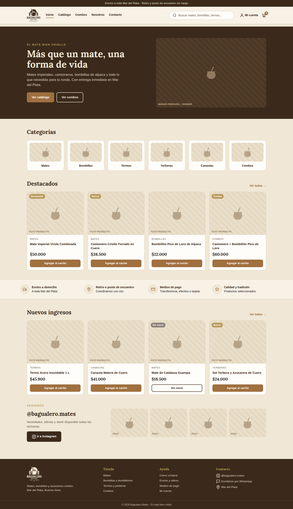 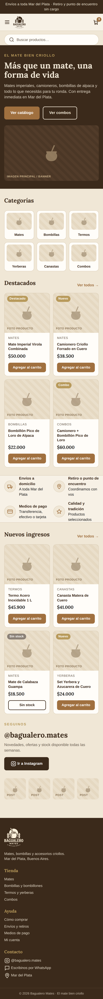

## Catálogo

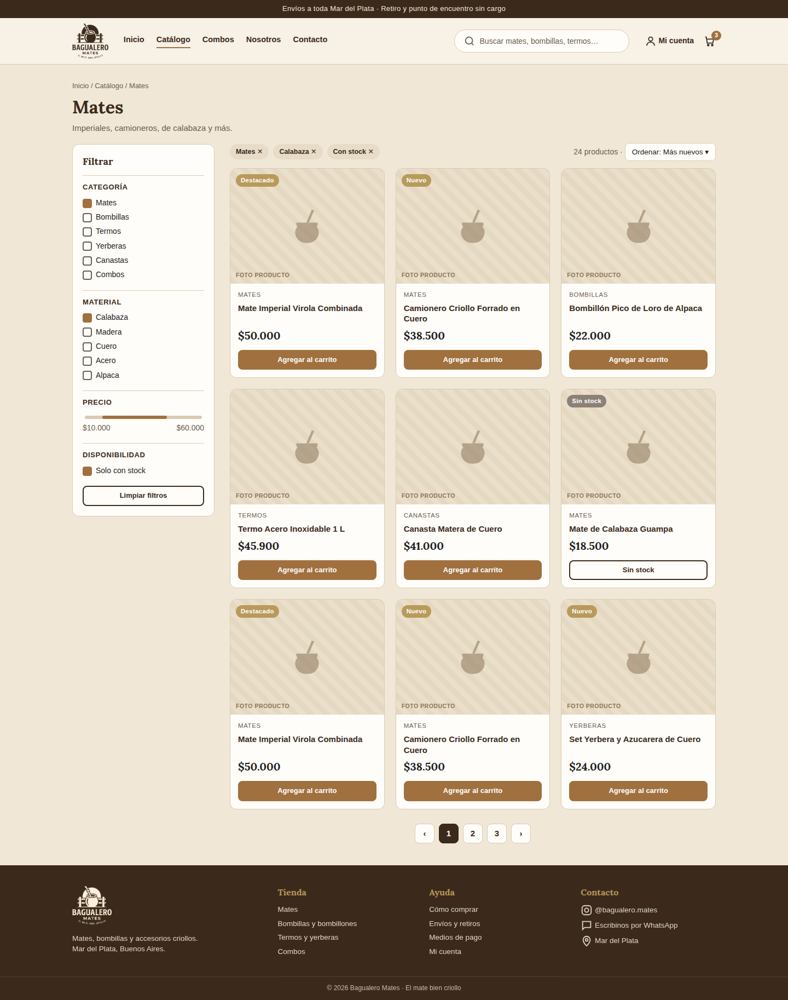 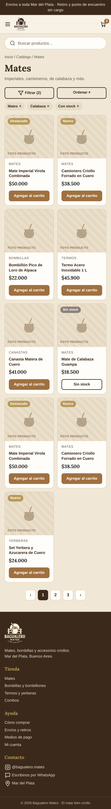

## Detalle de producto

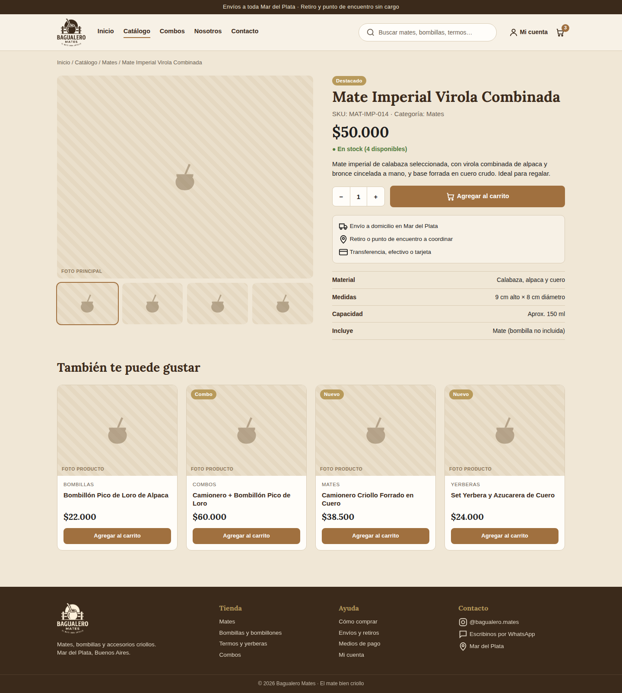 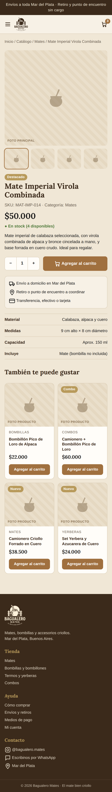

## Carrito

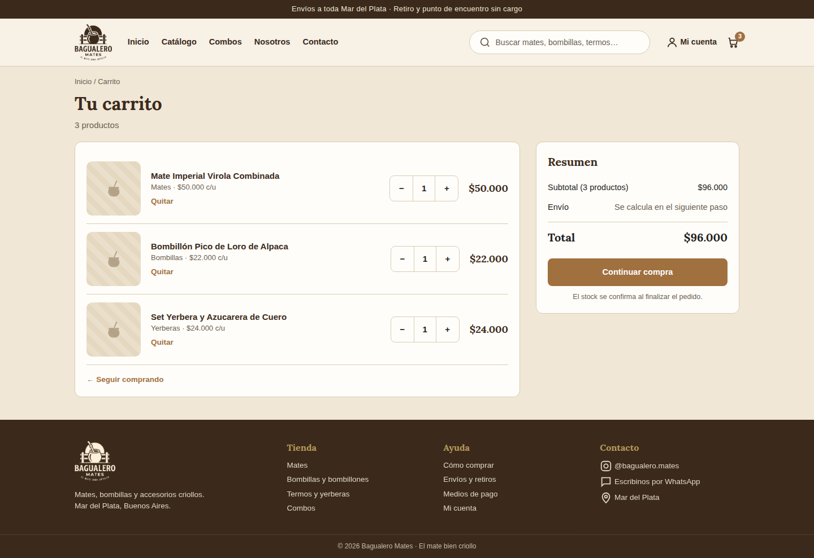 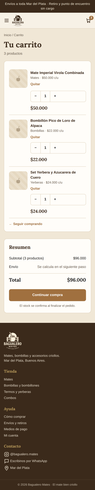

## Finalizar compra

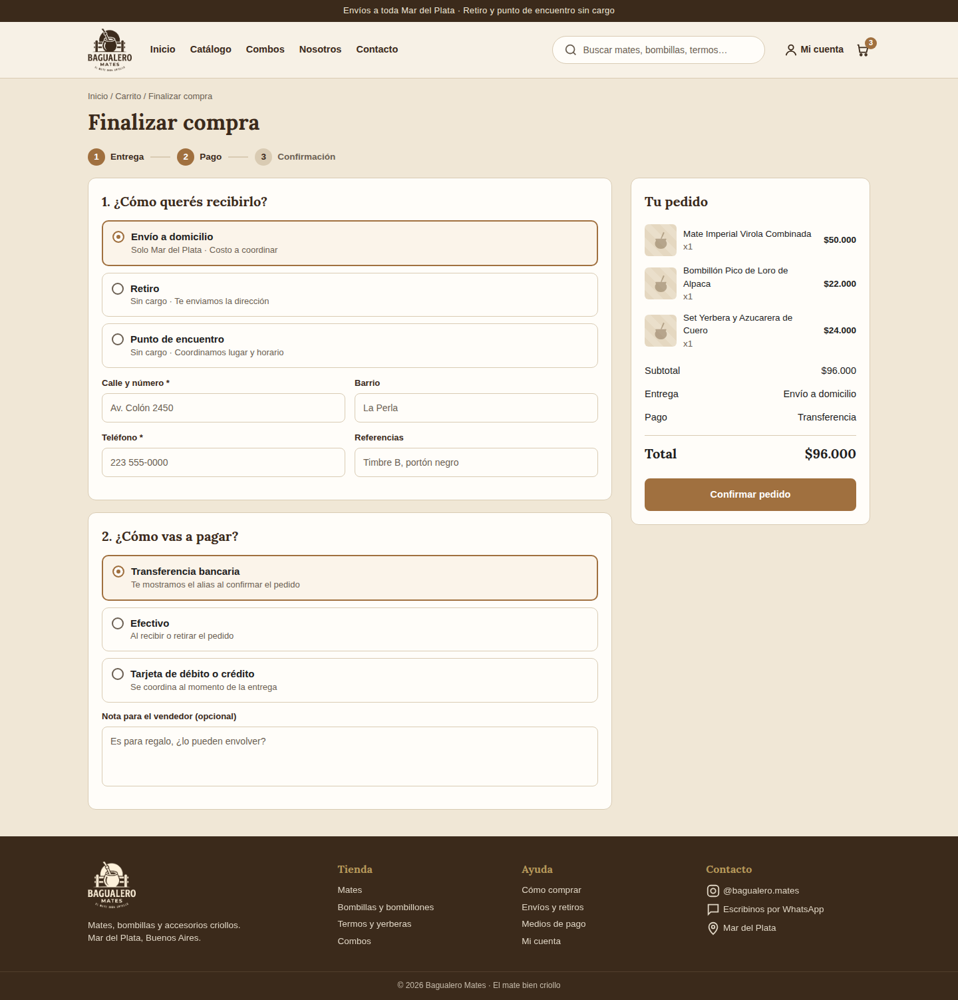 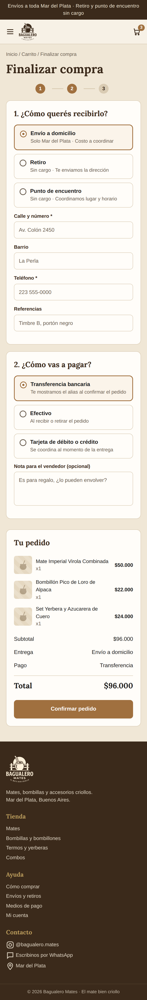

## Iniciar sesión / Crear cuenta

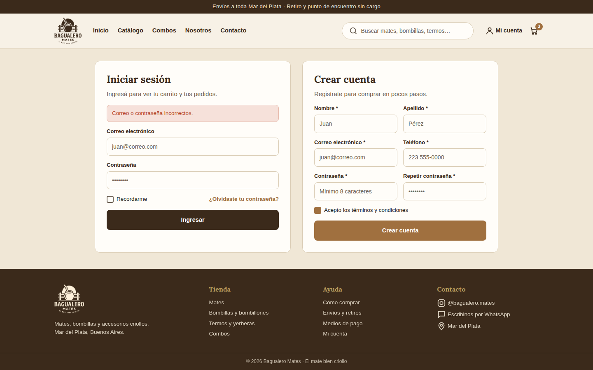 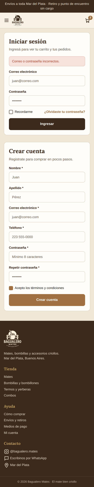

## Mi cuenta — Mis pedidos

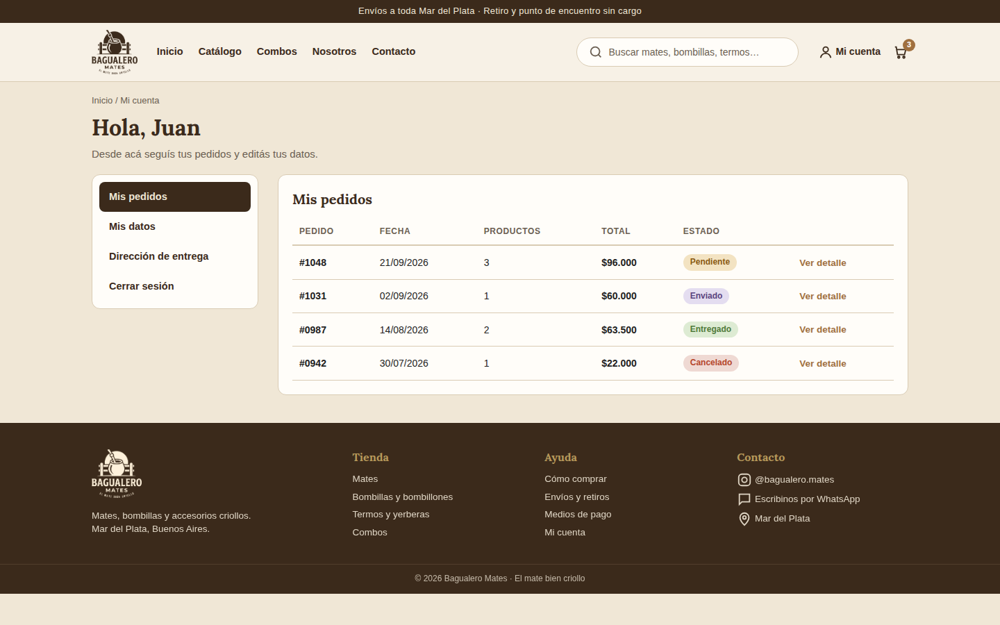 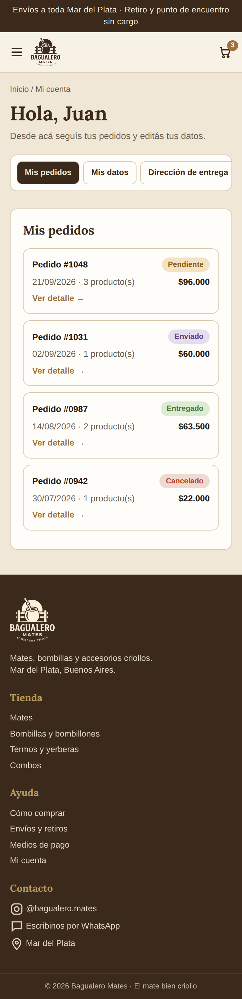

## Admin — Panel de control

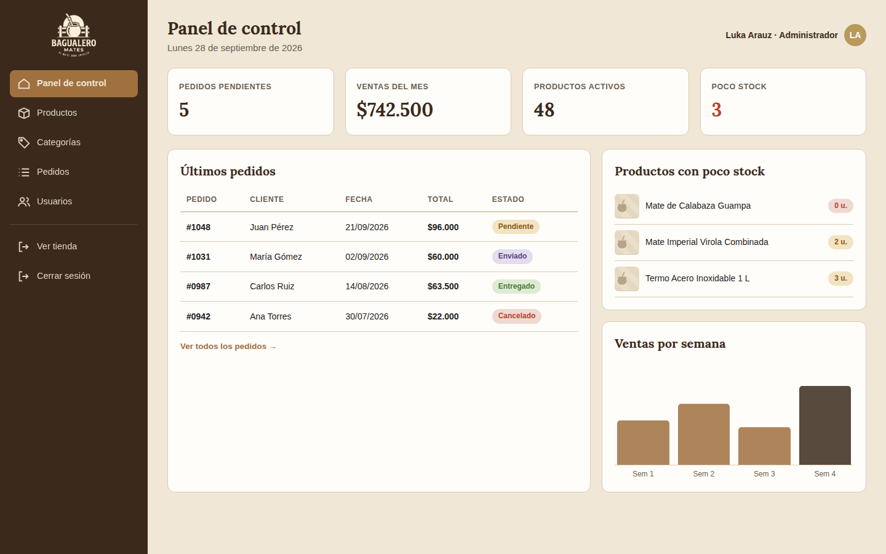 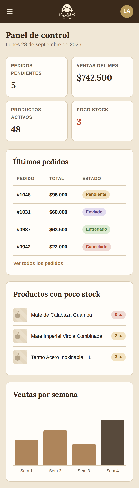

## Admin — Productos

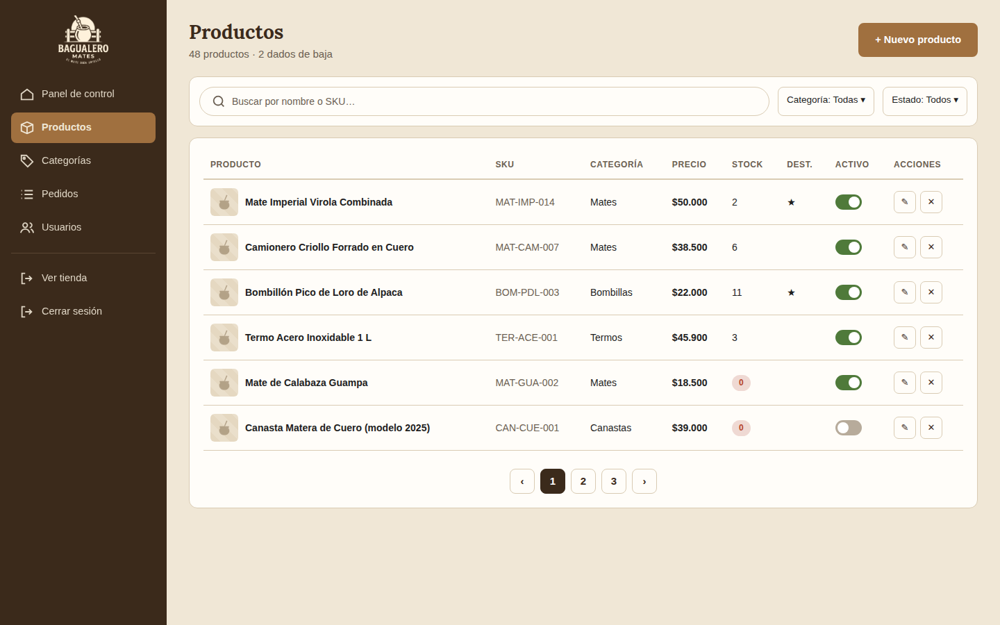 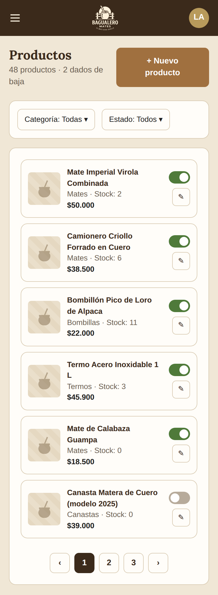

## Admin — Nuevo producto

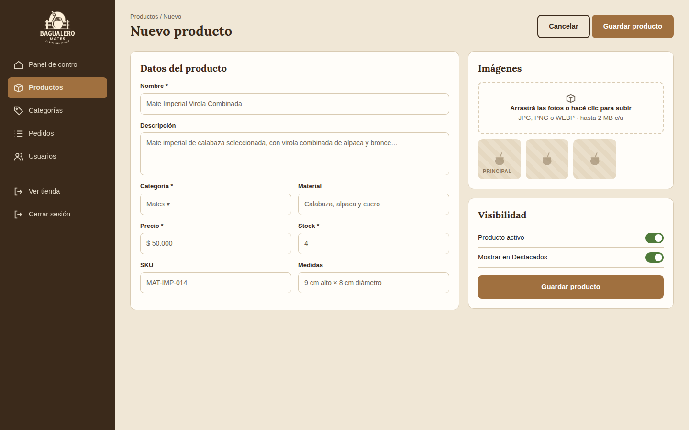 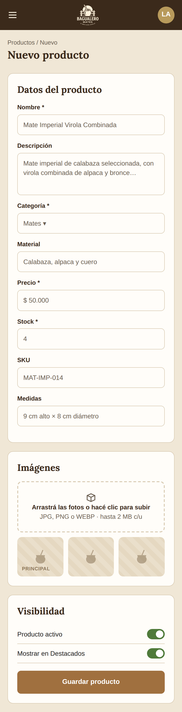
